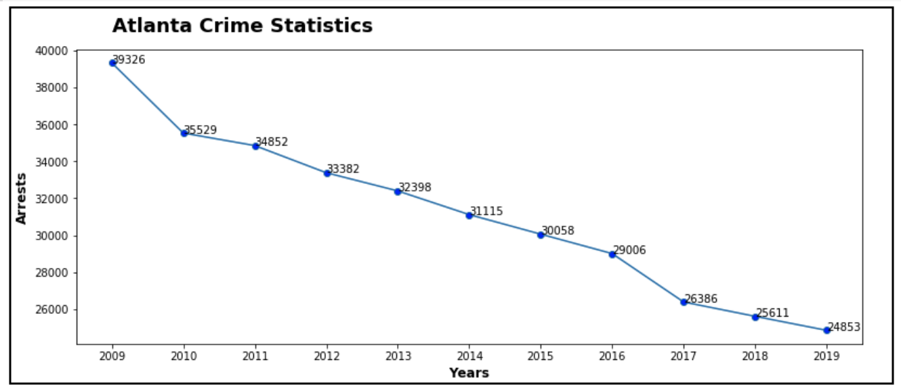
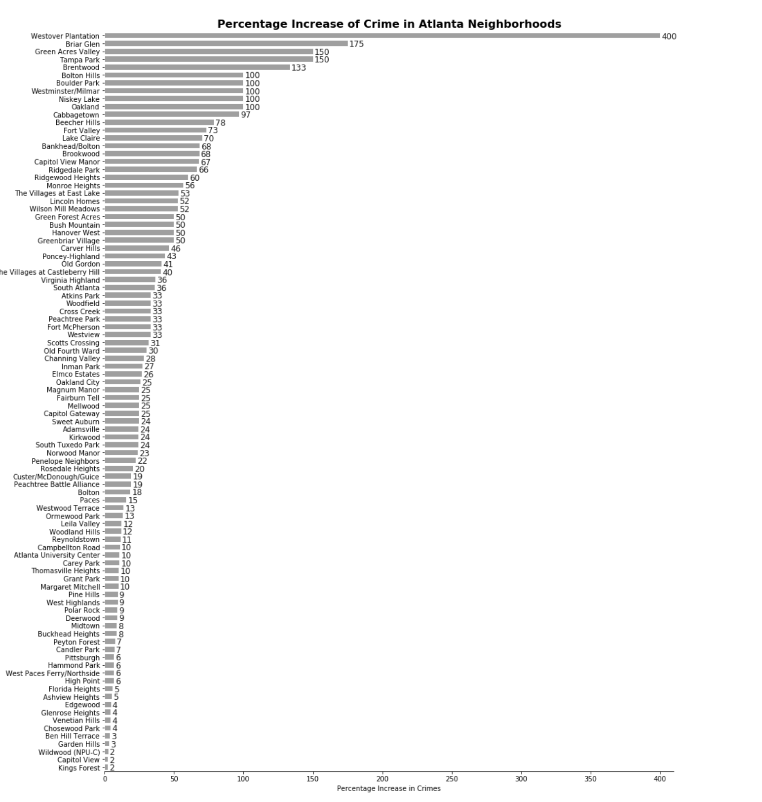
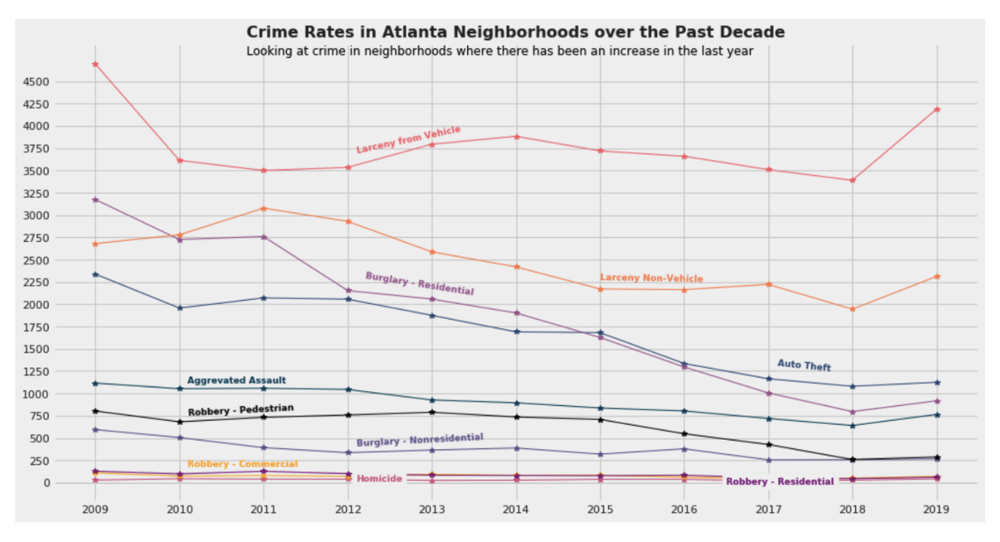

Atlanta is known as the New York City of the South. Having lived most of my life in New York, between the two greatest boroughs — The Bronx and Manhattan — I found this hard to believe. Prior to moving, my husband had sold me on an urban oasis, that had all the culture and excitement of New York but with more trees and less crime. When we settled down, I was ready to live a life of clean-aired leisure and safety but would this bubble soon be shattered?

After we purchased our home, I became active my in community. I joined the community page to keep abreast of happenings and try to do my part in being a good neighbor. One of the many recurring topics, especially in the past year, has been the rise in crime. Even my husband, who loves Atlanta, has taken notice. What did this mean? Should I run back to the comfort of the crime ridden streets of my childhood? Before packing my bags, I realized, I could test this with data.

I was able to find crime records from the Atlanta PD website (<a href="https://www.atlantapd.org/i-want-to/crime-data-downloads" target="blank">https://www.atlantapd.org/i-want-to/crime-data-downloads</a>), these records contain crime reports from 2009–2019. The first question I tried to answer with this data is crime in Atlanta on the rise?

<h2>Is Crime in Atlanta Rising?</h2>

<h5>According to this graph, crimes seems to have be on a steep decline since 2009.</h5>

After capturing a quick summary of the data, I could see that overall crime has been on a steep decline, but this did not satisfy me. I had more questions, was crime rates in all Atlanta neighborhoods decreasing? Also, were all crimes decreasing? So I dug further into the dataset to see what else I could find.

According to this graph, crimes seems to have be on a steep decline since 2009.

<h2>Yes, But… Did All Neighborhoods Have a Decrease?</h2>

<iframe id="igraph" scrolling="no" style="border:none;" seamless="seamless" src="../img/index.html" height="450" width="100%"></iframe>
<h5>This graph explores types of crimes committed in 2019 and plots them based on longitude and latitude.</h5>

Were all neighborhoods in Atlanta experiencing a decrease in crime? I wanted find out if my neighborhood of North Buckhead, experienced a surge (This would let me know if I needed to book my ticket). The Atlanta PD’s dataset, has neighborhood information recorded for the different crimes. Using this information I was able to aggregate crime rates by neighborhoods. The chart below shows the neighborhoods that have experienced an increase crimes.

My next question, is which crimes were to account for this increase? To find this out, I took a subset of the Atlanta PD dataset. I used the 94 neighborhoods that experienced a surge, to see which crimes were to blame for this increase.

<h4>Percentage Increase in Crimes by Neighborhood</h4>

<h5> <a href = "https://plotly.com/~jiobu1/18/" target="blank">https://plotly.com/~jiobu1/18/</a> — Click to view an interactive graph — shows the numeric increase from 2018 to 2019</h5>
 

Out of the 243 neighborhoods recorded in this dataset 38%, or 94 neighborhoods, experienced an increase in crime from 2018 to 2019. My neighborhood was not on this list but several surrounding neighborhoods has experienced an increase.

<h2>Which Crimes Attributed to the Rise in These Neighborhoods?</h2>

My next question, is which crimes were to account for this increase? To find this out, I took a subset of the Atlanta PD dataset. I used the 94 neighborhoods that experienced a surge, to see which crimes were to blame for this increase.

The crimes are grouped into 11 categories.

<h5>All crimes recorded crimes increased in these neighborhood, except for manslaughter.</h5>

To see this better, I created individual plots to highlight changes.

<iframe width="900" height="750" frameborder="0" scrolling="no" src="//plotly.com/~jiobu1/21.embed"></iframe>
<h5>These graphs use the 94 neighborhoods that have experienced an increase from 2018–2019</h5>

Of the 11 crime categories, 10 have increased in these neighborhoods. Homicides went up 46%, commercial robbery 43%, residential robbery 33%, vehicle larceny 24%, aggravated assault 19%, non-vehicle larceny 18%, residential burglary 15%, pedestrian robbery 11%, auto theft 4%, and non-residential robbery 4%. The only category which did not go up is manslaughter.

<h2>Conclusion…</h2>

While overall crime in Atlanta has been going down, several neighborhoods have experienced an uptick. My dreams of having found an urban oasis may burst soon. So… while, I have not purchased my ticket to go back to New York, I have my bags packed, just in case.

On the bright side, Atlanta still has more trees.

You can view my code on <a href = "https://github.com/jiobu1/DS-Unit-1-Sprint-4-Data-Storytelling-Portfolio-Project/blob/master/Jisha_Obukwelu_Unit_1_Data_Storytelling_Project.ipynb" target="None"> GitHub.</a>

