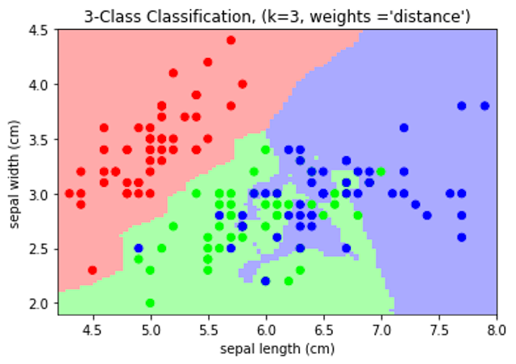
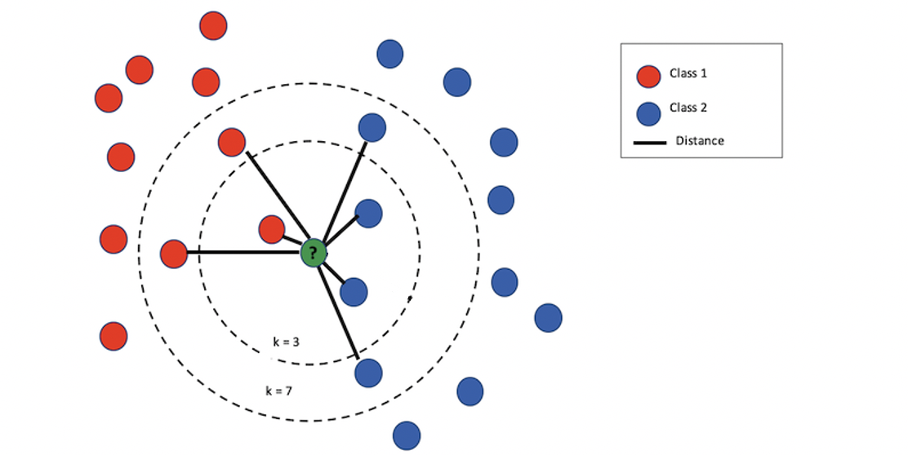
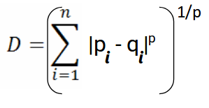
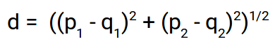
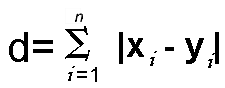
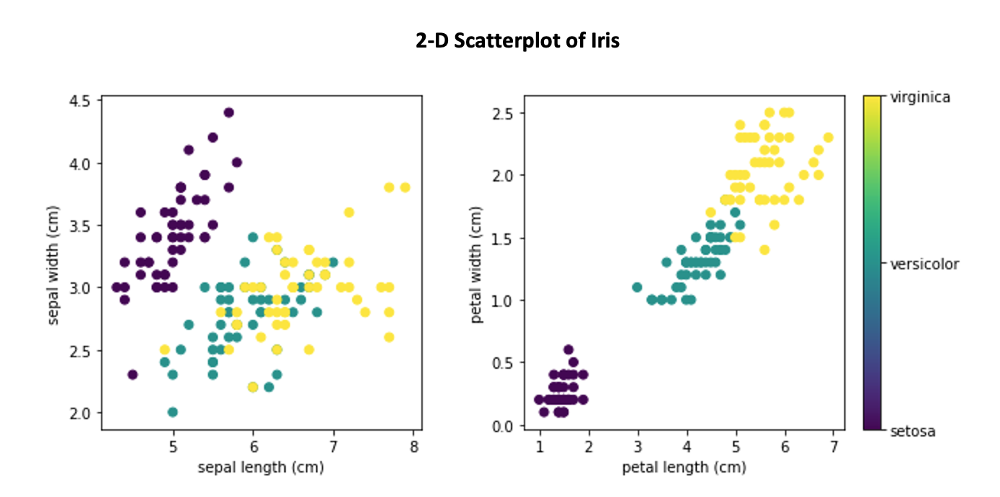
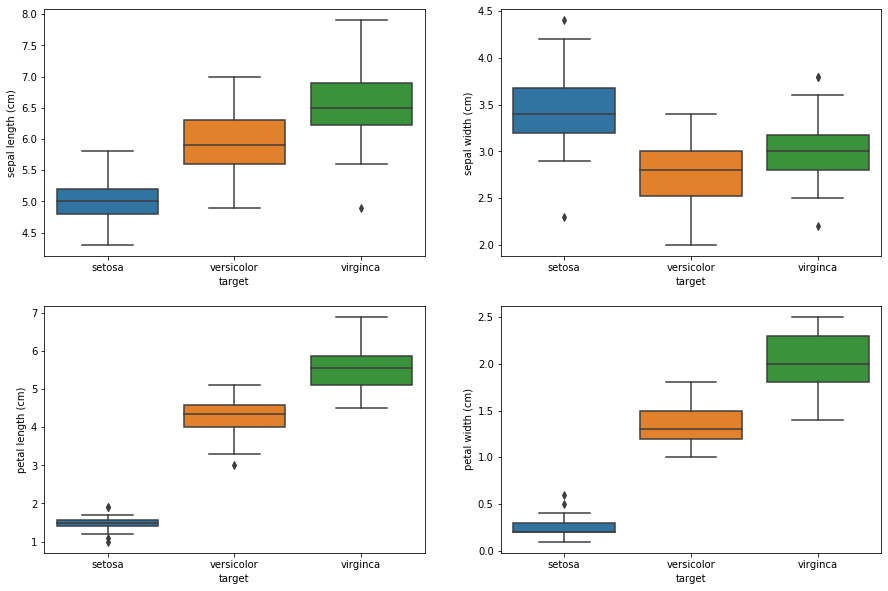
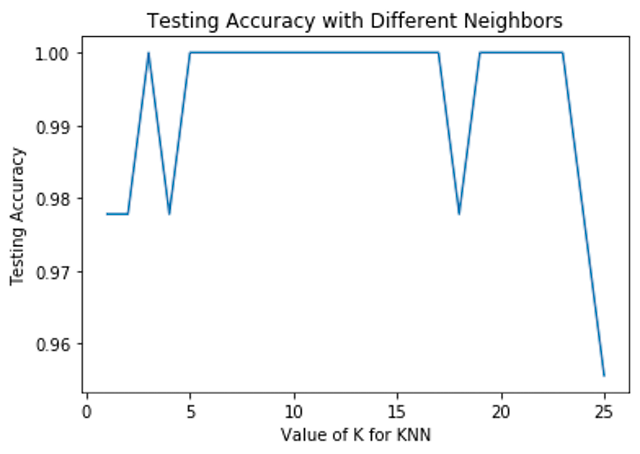

<figure>
    
    <figcaption>Decision boundary of nearest neighbors decision on Iris dataset with 3 nearest neighbors</figcaption>
</figure>

<h2>What is KNN Algorithm?</h2>

K-Nearest Neighbor (KNN)is a non-parametric supervised machine learning algorithm. (Supervised machine learning means that the machine learns to map an input to an output based on labeled training data.) It is one of the simplest algorithms used in machine learning for regression and classification. KNN follows the “birds of a feather” strategy in determining where the new data fits. KNN uses all available data and classifies the new data or case based on a similarity measure, or distance function. The new data is then assigned to the class to which most neighbors belong to. 

<h2>Why is KNN called a “Lazy Learner”?</h2>

KNN is often referred to as a <b>lazy learner</b>. This means that the algorithm does not use the training data points to do any generalizations. In other words, there is no explicit training phase. Lack of generalization means that KNN keeps all the training data. It is a <b>non-parametric learning algorithm</b> because it doesn’t assume anything about the underlying data.

<h2>How to make predictions using KNN algorithm?</h2>

To classify an unknown instance represented by some feature vectors as a point in the feature space, the KNN classifier calculates the distances between the point and points in the training data set. Usually, the <b>Euclidean distance</b>is used as the distance metric.

<figure>
    
    <figcaption>Find the mode of the labels the new data is closet to.</figcaption>
</figure>

<h4>Distance Formulas</h4>

Below are other distance formulas used in the KNN algorithm.

<ul>
    <li><b>Minkowski distance</b> is a normed vector space that can be considered as a generalization of the Euclidean distance and the Manhattan distance.
        <figure>
            
            <figcaption>Minkowski distance</figcaption>
        </figure>
    </li>
    <li><b>Euclidean distance</b> is the most commonly used distance formula when calculating KNN. Euclidean distance formula finds the shortest distance between points A and B. This is sometimes referred to as the Pythagorean Theorem
        <figure>
            
            <figcaption>Euclidean distance</figcaption>
        </figure>
    </li>
    <li>Another distance formula is the <b>Manhattan distance</b> formula. This formula takes the sum of the absolute values of the differences of the coordinates.
        <figure>
            
            <figcaption>Euclidean distance</figcaption>
        </figure>
    </li>
    <li>Other formulas include Chebyshev, Wminkowski, Seuclidean, Mahalanobis.</li>
</ul>

You can read this article about the importance of distance formula in calculating KNN. <a href="https://arxiv.org/pdf/1708.04321.pdf">https://arxiv.org/pdf/1708.04321.pdf</a>

<h2>How to choose the value of k?</h2>

The “K” in KNN stands for the number of nearest neighbors the model is using to figure out how to assign a class for your new data. This is an important parameter for achieving better accuracy of your model. While there is no structured method to find the best value for K, here are some suggestions.

<ol>
    <li>Take the square root of N, where N is the number of samples in your training data (k=sqrt(N)).</li>
    <li>Choose an odd number. This helps to avoid confusion between two classes of data.</li>
    <li>Cross-Validation. Use a small subset of the training data, called the validation set, and test out different possible values of K. Then choose the K that yields the best results for the validation set.</li>
</ol>

<h2>Implementing the KNN Algorithm</h2>

The KNN model can be implemented in 4 easy steps. To demonstrate the KNN algorithm, I am using it on the iris dataset. This is a preloaded dataset from the sklearn library. The iris dataset includes three iris species — Setosa, Versicolor, Virginica, with 50 samples from each. For each sample, we have sepal length, width, and petal length, and width.

<figure>
    
    <figcaption><a href="https://www.datacamp.com/community/tutorials/machine-learning-in-r"> Machine Learning in R for beginners</a></figcaption>
</figure>

<h4><b>1. Look at the Data</b></h4>

The KNN algorithm will use the relationships between the 4 features and to make predictions on the test data.

<figure>
    
    <figcaption>Boxplot of Iris Features</figcaption>
</figure>

<pre>
<code>
    # Load Data
    # Import library
    from sklearn.datasets import load_iris

    iris = load_iris()

    # Separate into target and features
    # Scale features
    X = scale(iris.data)
    y = iris.target
</code>
</pre>

1a. Initialize K to your chosen number of neighbors

<pre>
<code>
    Instantiate model
    clf = KNN(k=13)
    I used 13 because this is approximately the sqrt(n) as mentioned above.
</code>
</pre>

1b. Fit the model

<pre>
<code>
    Fit on X_train and y_train
    clf.fit(X_train, y_train)
</code>
</pre>

For the fit, KNN is just adding the training data to memory. There is no active training phase.

<h4><b>2. For each example in the data:</b></h4>
<ul>
    <li>Calculate the distance between the query example and the current example from the data.</li>
    <li>Add the distance and the index of the example to an ordered collection</li>
</ul>

<pre>
<code>
    <b># Distance Formula</b>
    def euclidean_distance(self, point1, point2, length):
         distance = 0

        for x in range(length):
              distance += (point1[x]-point2[x])**2

        return np.sqrt(distance)

    <b># Calculate distances between X_train and X_test</b>
    def _get_distance(self, X_test):
        length = X_test.shape[1]

        # Initialize distance array
         distances = []

        for idx in range(len(X_test)):
            # record X_test id
            # initialize an array to hold distances
            distances.append([ X_test[idx], [] ])

            # Loop through each row in x_train
              for row in self.X_train:

                # find the euclidean distance
                # append to distance list
                dist = self.euclidean_distance(row, X_test[idx], length)
                distances[idx][1].append(dist)

        return distances
</code>
</pre>

<h4><b>3. Find the neighbors</b></h4>
<ul>
    <li>Sort the ordered collection of distances and indices from smallest to largest (in ascending order) by the distances</li>
    <li>Pick the first K entries from the sorted collection</li>
    <li>Get the labels of the selected K entries</li>
</ul>

<pre>
<code>
    # Get Predictions
    def _get_labels(self, distances):
         # Initialize y_pred array
         y_pred = []

        for row in range(len(distances)):

            # sort distances and record up to k values
            distance = distances[row]
            y_indices = np.argsort(distance[1])[:self.k]

            #  find the classes that correspond with nearest neighbors
            k_nearest_classes = [self.y_train[i%len(self.y_train)] for
                                  i in y_indices]

            # get label based on the mode of the classes
            label = [stats.mode(k_nearest_classes)][0][0][0]

            y_pred.append(label)

        return y_pred
</code>
</pre>

<h4><b>4a. If classification, return the mode of the K labels</b>.</h4>
<h4><b>4b. If regression, return the mean of the K labels</b></h4>

<pre>
<code>
    def <b>predict</b>(self, X_test):
         distances = self._get_distance(X_test)
         return self._get_labels(distances)

    <b>Predict on X_test</b>
    predict = clf.predict(X_test)

    <b>This returns:</b>
    [1, 0, 2, 1, 1, 0, 1, 2, 1, 1, 2, 0, 0, 0, 0, 1, 2, 1, 1, 2, 0, 2,
    0, 2, 2, 2, 2, 2, 0, 0, 0, 0, 1, 0, 0, 2, 1, 0, 0, 0, 2, 1, 1, 0, 0]

    <b>Calculate accuracy</b>
    accuracy_score(y_test, predict)

    <b>KNN model accuracy: 1.0</b>
</code>
</pre>

<h2>Optimizing with K Values</h2>

You can check the error rate for different values of k. This will help determine if the choice of k is the best for your model.

<h2>How is KNN used?</h2>

KNN is a simple yet powerful algorithm since it requires no training for making predictions. Below are a few applications of the KNN algorithm.

<ul>
    <li>Recommendation Systems: KNN is used for creating simple recommendations systems such as the ones used by Amazon or Netflix to make movie suggestions or suggest an item for purchase.</li>
    <li>Credit Rating: KNN algorithms can be used to find an individual’s credit rating by making comparisons between a person’s financial information and comparing them to others with similar information.
    </li>
    <li>Banking: Should a bank give a loan to an individual. Will the person default on his or her loan?</li>
    <li>Other examples include handwriting detection, image recognition, and even video recognition.</li>
</ul>

<h2>When to use KNN?</h2>

KNN is a powerful algorithm but it is not the best algorithm for all machine learning models. So when do should we use it? KNN is useful for data that is noise-free, small, and labeled.

<h2>Pros and Cons of KNN</h2>

<b>Pros</b>

<ul>
    <li>It is easy to use, only need k and distance formula.</li>
    <li>Quick calculation time with relatively high accuracy. Since it is a lazy learner there is no training necessary.
    </li>
    <li>Versatile, can be used for regression or classification.</li>
</ul>

<b>Cons</b>

<ul>
    <li>Computationally expensive because it has to store all the training data and there is high memory storage required.</li>
    <li>Sensitive to irrelevant features and the scale of the data.</li>
    <li>Can be slow depending on the size of the data.</li>
</ul>

<h2>Summary</h2>

KNN is a simple, yet powerful and flexible, algorithm that can be used for both regression and classification problems.

4 Easy Steps:

<b></b>

<ol>
    <li>Look at the data.</li>
    <li>Calculate the distance.</li>
    <li>Find neighbors.</li>
    <li>Find the most common label.</li>
</ol>

...

<h2>Find Code:</h2>

Find the code on <a href = "https://github.com/jiobu1/CS_Build_Week_1">Github</a>.

<h4><b>Specific Files:</b></h4>

Find the code for my KNN algorithm <a href = "https://github.com/jiobu1/CS_Build_Week_1/blob/main/KNN/knn.py">here</a>.

Find the code for my KNN test as .py file <a href ="https://github.com/jiobu1/CS_Build_Week_1/blob/main/KNN/knn_test.py">here</a> or as jupyter notebook <a href ="https://github.com/jiobu1/CS_Build_Week_1/blob/main/KNN/knn_test.ipynb">here</a>. (I compare my algorithm to KNeighborsClassifier, in the sklearn library).

Find my data visualizations of the iris dataset <a href="https://github.com/jiobu1/CS_Build_Week_1/blob/main/KNN/Exploratory_Analysis/iris_visuals.ipynb">here</a>.

<h2>Sources:</h2>
<ul>
    <li><a href ="https://scikit-learn.org/stable/modules/generated/sklearn.neighbors.KNeighborsClassifier.html">https://scikit-learn.org/stable/modules/generated/sklearn.neighbors.KNeighborsClassifier.html</a></li>
    <li><a href ="https://arxiv.org/pdf/1708.04321.pdf">https://arxiv.org/pdf/1708.04321.pdf</a></li>
    <li><a href ="https://en.wikipedia.org/wiki/K-nearest_neighbors_algorithm#Algorithm">https://en.wikipedia.org/wiki/K-nearest_neighbors_algorithm#Algorithm</a></li>
</ul>

<pre>
<code>
</code>
</pre>