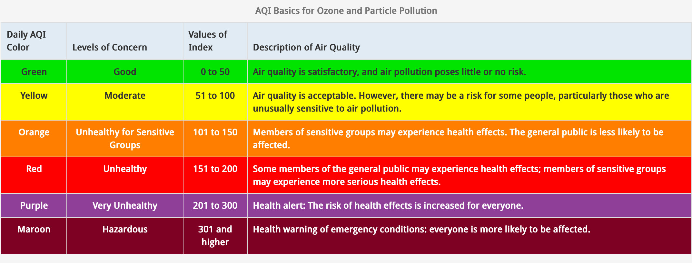
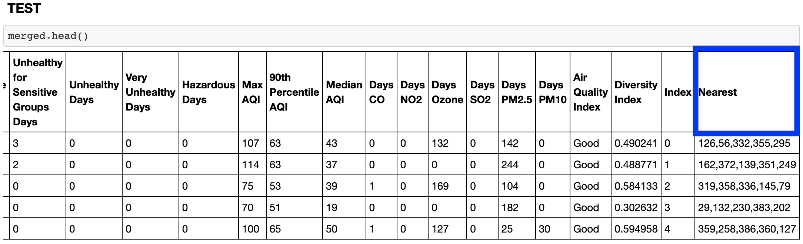
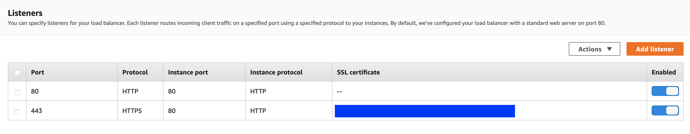
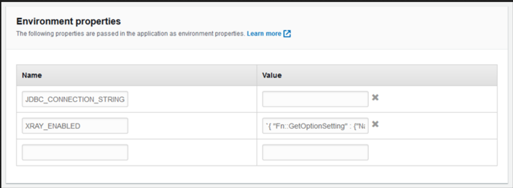
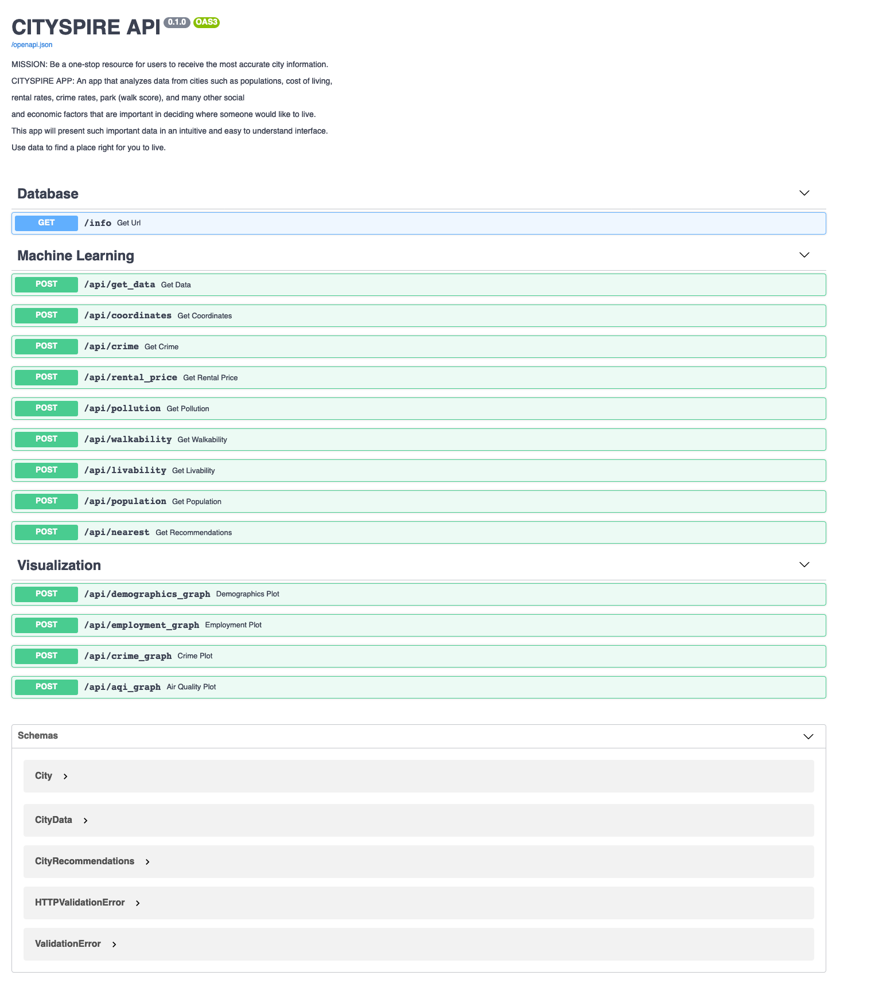
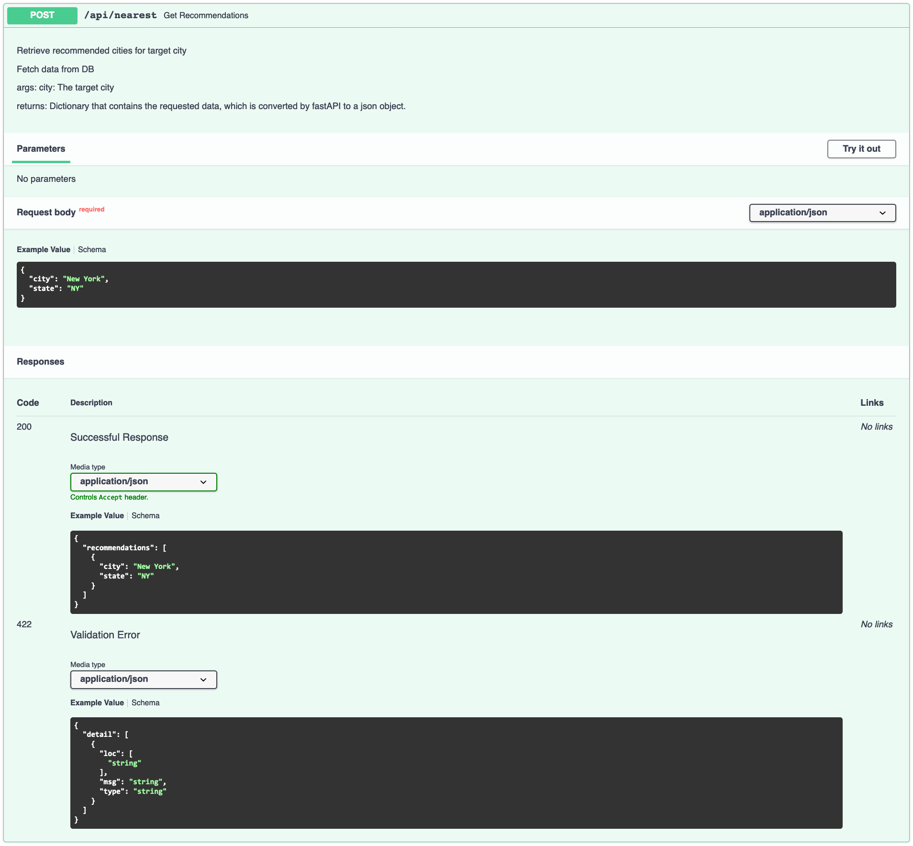

**TLDR:** Worked for 8 weeks (part time) as a data scientist and machine learning engineer on a remote interdisciplinary team; helped to gather, clean and wrangle data to create a recommendation model; created an AWS RDS Postgres database to store data and sent this information to front end through endpoints tested with FastAPI and deployed using AWS Elastic Beanstalk.

<h5 align="center"> https://images.squarespace-cdn.com </h5>  

## Introduction:

***- Eeny, Meeny, Miny, Moe, is this how you will find your new home city?***

**Problem:** Imagine you are looking to relocate, how do you decide which new city is right for you? Should you ask friends? Look at Yahoo, Google or TripAdvisor? Moving is not easy and it is a big decision. Where will you find information such as rental prices? What are the demographics of the place, crime rate, pollution? Will you need a car to live there or is it pedestrian friendly? How will you find all this information? You could take hours googling different websites or you can checkout CitySpire.

**Solution:** CitySpire’s goal is to be a one-stop resource for users to receive the most accurate city information. We take the hassle out of finding the perfect city to call home by giving you a data driven recommendation in a simple format. This app analyzes data from cities such as populations, cost of living, rental rates, crime rates, park (walk score), and many other social and economic factors that are important in deciding where someone would like to live. This app presents this information in an intuitive and easy to understand interface.

**Constraints:** This is the most ambitious project I have undertaken to date. My team and I were working on a tight deadline and had several new technologies that we had to get up to speed on.

As the data scientist team, we were tasked with finding, cleaning, and wrangling data. We then had to create a recommendation system using machine learning. Finally, with this information create a livability index to help users make informed decisions about which city they would like to move to. We also had to make sure that this information was readable by our front end engineers.

While cleaning and wrangling data may seem tedious or rudimentary, for continuity across the data we had to wrangle things like how a city name should appear. Another constraint was learning new technologies on the job since our stakeholder expected AWS deployment but all the data scientists on the team only had experience Heroku.

## Planning:

**Design Architecture**

The first few weeks of the project were spent entirely on planning: reading through our product documentation, getting a sense of what data was available to use (whether as datasets, APIs, or if we would have to do web scraping), facilitating data science meetings to create outlines and timelines, and most importantly: our daily meeting with our Team Lead and web developers to keep each other abreast of our planning and to ensure that our final product will be accurately aligned with our stakeholder’s vision.

To ensure that we were all on the same page, I designed our system architecture so we had a visual representation of the data acquisition, storage, analytics, machine learning, API gateway, and data feedback. This helped us begin with the end in mind rather than trying to build the bridge as we tried to across it.

<h5 align="center"> System architecture for CitySpire </h5>  

**From roadmap to implementation**

Since we were limited in time and breadth of the project was pretty large, we got right to work. Using the product documentation, we created task cards using Trello so that we could make sure to meet [release features](https://www.notion.so/CitySpire-c5071dd8198441b6999aefbbbc851ca7).

## Data:

***Let the good times roll!***

**Collection, Evaluation, and Cleaning**

As the data scientists on the team, we were responsible for finding information about the cities, i.e. crime, rent, pollution, etc. We spent a lot of time gathering the data that would provide the information that the stakeholder wanted to include in his app.

**Cleaning**

***Oh, the cleaning!***

We had to wrangle information to make sure things such as naming conventions were the same across all the data, such as ‘Saint Louis’ vs. ‘St. Louis’, or ‘Fort Bragg’ vs. ‘Ft. Bragg’. We knew that intensive data cleaning would be necessary to ensure data integrity and continuity between each of our sources.

**Examples**

**Wrangle Function:**

<h5 align="center"> Wrangle function for cleaning FBI crime data and allowing me to merge the 50 states into a single csv. </h5>   

**Using pipe**

Another noticing, was that several datasets had cities hyphenated, such as Albany-Schenectady-Troy, NY. In this case not only did I have to do a split on the city and state but I also had to a create a function that would separate the cities by ‘-’ and then copy the row information for each respective city.

There were several functions that needed to be applied, so I used a method called pipe to have my specific functions as a method on the DataFrame in method chains. This allows my fellow engineers to easily follow my process.

<h5 align="center"> Using .pipe on pollution data </h5>  

**Evaluating:**

**Mapping census tract information to city**

Besides cleaning, another important part of the process is evaluating the data and then making some assumptions or decisions about the data and how to use it. One source, we relied on for getting information was the Census Bureau. This app is a city based app but census information is formatted by either tracts or county. As a data scientist, I had to translate tract information to city, and to do this there were several assumptions I had to make. I utilized a file from HUD that maps tracts to zip codes. There was a column named “res_ratio”, that mapped the percentage of a tract population living within a specific zip. I made the assumption, after discussing with my team and stakeholder, to use this ratio for things such as demographics, income, and employment numbers.

**Other decisions**

Another data driven decision was determining how to summarize certain information to disseminate to the user. Users normally want a snapshot or a succinct representation of the data and it is important to convey this information without bias. I created a summary column for crime, pollution, and diversity.

**[Crime Rate per 1,000 inhabitants:]("https://www.njsp.org/info/ucr2000/pdf/calc_ucr2000.pdf")** To summarize crime data, I used FBI crime reporting standard of reporting crime per 1000 residents. This represents the number of Index offenses per 1,000 inhabitants.For example: What is the crime rate for a municipality with 513 Index offenses (murder, rape, robbery, aggravated assault, burglary, larceny-theft and motor vehicle theft), with a population of 8,280? 513 (Index offenses) ÷ 8,280 (population) = .061957 x 1,000 = 62.0 (crime per 1,000 inhabitants). This was then binned into “High”, “Medium”, and “Low” using pd.qcut.

  

**Air Quality Index:** To determine overall air quality for each city, I used the median value and then created an algorithm that separated it based on the U.S. air quality index.

<h5 align="center">  AQI basics for ozone and particle pollution </h5>  

**Diversity:** To summarize diversity, I use the Simpson’s Diversity Index.

  

* n = numbers of individuals of each ethnicity
* N = total number of individuals of all ethnicities
* The value of D ranges between 0 and 1

These summary numbers of crime, pollution, diversity, along with the walkability score were then used to calculate the livability score.

## Model:

**Nearest Neighbors**

A feature that our team thought would be beneficial to the user was to create a recommendation system. After conferring with our Team Lead and getting an approval, I set out to implement this feature.

Most people when looking to relocate, already have a city in mind but we felt that getting a recommendation of similar cities would be a way to open up other possibilities of where the user could look to move to.

To implement the recommendation system, I used a machine learning model called [nearest neighbors](https://scikit-learn.org/stable/modules/neighbors.html) from sci-kit learn library. After merging the different data we collected into a dataframe, I scaled the data, so that columns such as rent and population did not get weighted heavier than percentages or decimal numbers. Then a column called nearest was added to the dataframe. This data is then returned using the get_recommendations endpoint.

  

<h5 align="center"> This is the column used in get_recommendations endpoint </h5>  

## New Tech:

One of the exciting parts of working on this product was getting experience with new technology. Fortunately, both [FastAPI](https://fastapi.tiangolo.com/tutorial/) and [AWS](https://aws.amazon.com/getting-started/) ([RDS Postgres](https://docs.aws.amazon.com/AmazonRDS/latest/UserGuide/CHAP_GettingStarted.CreatingConnecting.PostgreSQL.html), [Elastic Beanstalk](https://docs.aws.amazon.com/elasticbeanstalk/latest/dg/Welcome.html)) have great documentation.

This was where the fun really began!

## FastAPI:

**Getting started**

Having worked with Flask, there were a lot of similarities that I could carry over. This article [“FASTAPI for Flask Users”](https://amitness.com/2020/06/fastapi-vs-flask/) was very helpful.

To get started we needed a [main.py](https://github.com/jiobu1/labspt15-cityspire-g-ds/blob/main/app/main.py) file which was provided in our repository, so to test it out, it was as simple as running the following series of commands:

<h5 align="center"> 1. Install all dependencies needed for application </h5>  

<h5 align="center"> 2. entering into the virtual environment where the correct dependencies are installed </h5>  

<h5 align="center"> 3. This deploys your FastAPI app. </h5>  

If you run the server and go to the endpoint ``http://127.0.0.1:8000/docs``, you will get an auto-generated swagger documentation. FastAPI is easy to use and the best part is the documentation, which it grabs from your docstrings. This makes it easy to show how to work with the endpoints rather than having to go to separate documentation, like README.md (this would have been where I provided documentation and links if I was working with Flask).

## AWS Elastic Beanstalk:

After creating and testing our basic endpoints, now we were ready to deploy the app to AWS Elastic Beanstalk. Our Team Lead provided us with with 12 digit account ID(IAM), and an AWS username & password. After installing ``awscli`` and ``awsebcli`` , we were able to run the following commands and we were in business!

1. `eb init --platform docker CHOOSE-YOUR-NAME --region us-east-1`
2. `eb create --region us-east-1 CHOOSE-YOUR-NAME`
3. `eb open`

Then when making changes, commit your changes using git and then run eb deploy and eb open to re-deploy the application with the changes.

One thing we learned the hard way, was when connecting with the front end we needed to be sure to configure the correct ports so information can be received from HTTPS traffic. We had to create a 443 Listener Port when the default setting only has a Port 80, which only allows HTTP traffic.

<h5 align="center"> Ports needed for HTTP and HTTPS traffic </h5>  

## AWS RDS Postgres:

Creating a database with AWS RDS was very straightforward. I signed in to the AWS Console and chose the region. Then I just went through the standard create and chose a PostgreSQL, and I was able to create the database instance with their default settings.

When developing locally, I used [python-dotenv](https://pypi.org/project/python-dotenv/) to load an ``.env`` file. (The ``.env`` file is listed in ``.gitignore``.) This made sure that the my username and password were protected. When deploying, we used the Elastic Beanstalk console for [configuring environment variables](https://docs.aws.amazon.com/elasticbeanstalk/latest/dg/environments-cfg-softwaresettings.html#environments-cfg-softwaresettings-console) there.

<h5 align="center"> Include Database name and url — connects to Elastic Beanstalk </h5> 

## API:

**Endpoints:**

Having successfully established a connection to the database and deployed the basic API to AWS, the next steps were in building out the API itself, including the routes (endpoints), functions, and documentation for usage.

<h5 align="center"> Data Science Endpoints </h5>  

For the DS team, I created the API endpoints for the [nearest neighbors model](https://github.com/jiobu1/labspt15-cityspire-g-ds/blob/main/app/ml.py) and the [visualization](https://github.com/jiobu1/labspt15-cityspire-g-ds/blob/main/app/viz.py) endpoints.

<h5 align="center"> Nearest Neighbors API endpoint — pulls docstring from .py file. Shows successful response and error messages. </h5>  

**Visualization** 

**A picture is worth a thousand words.**
Below are the interactive plotly visualization endpoints that I created. These endpoints enables users to see data points presented visually as well as dive deeper into each statistic. Using charts or graphs to visualize large amounts of data makes it easier to understand.

<iframe width="900" height="800" frameborder="0" scrolling="no" src="//plotly.com/~jiobu1/25.embed"></iframe>
<h5 align="center"> /api/demographics_graph — shows percentage from each race category </h5>  
  

<iframe width="900" height="800" frameborder="0" scrolling="no" src="//plotly.com/~jiobu1/27.embed"></iframe>
<h5 align="center"> /api/employment_graph — breaks down industry sectors and employment type </h5>   
  

<iframe width="900" height="800" frameborder="0" scrolling="no" src="//plotly.com/~jiobu1/31.embed"></iframe>
<h5 align="center"> /api/aqi_graph — goes more in depth into air quality for each city </h5>  

## Final Thoughts:  

Working on this project has been both exciting and rewarding. I was excited about learning on the job and was glad that my training and education, thus far, set me up for success for working with AWS and FastAPI. I was pleasantly surprised at how easy AWS makes it to deploy and manage web apps, and impressed with FastAPI and its built in features that make using it for creating DS endpoints a no brainer.  

Another important lesson I learned from this process is when working with stakeholders and a large team, constant communication is key. It was important to utilize the product scope to make sure that we were lock step in achieving the vision that the stakeholder had for CitySpire, and not our false assumptions. Also, communication was important in making sure each team member knew what they were responsible for. Creating the system architecture and trello board provided us an important road map as well as kept us accountable.  

CitySpire is the most ambitious project I have undertaken. I learned many things such as scoping a project, communication, and being open to learning on the job. As such, it provided to me many valuable, foundational experiences that I’ll surely keep with me throughout my entire career.

**Potential Improvements:**   

Thus far in the project, we’ve been able to implement rental price estimates, walk score, crime, population, pollution, and a livability score on the DS API as well as the front-end web site. Some possible next steps are:

- Rental prediction model
- Population prediction model
- Pollution prediction model
- Incorporating prevalent industries for each city
- Integrating other data points, such as bus and bike scores
- Implementing visualization APIs
- Creating a NLP recommendation system, where users can set criteria and receive results based on their query.

**Team Overview:**  

I worked for 8 weeks (part time) as a data scientist and machine learning engineer on a remote interdisciplinary team to create CitySpire.  

<h5 align="center"> CitySpire — Team G </h5>  

I worked with an amazing team. The team included myself and three other data scientists, three web developers, one UX designer, and our Project Lead who kept up our energy and made sure we were moving in the right direction. Everyone was hardworking and immediately rolled up their sleeves ready to work. (Our team did such a good job, that out of the 8 other teams, our repository was chosen for future cohorts to build upon.)  

**Role:** App Architect, Data Scientist, Machine Learning Engineer, Data Visualization  

**DS Tech Stack:** Python, FastAPI, AWS RDS Postgres, AWS Elastic Beanstalk, Docker  

**Timeline:** 8 weeks (part-time)  

Our final Github repository can be found [here](https://github.com/jiobu1/labspt15-cityspire-g-ds).

## Demo:

<iframe width="560" height="315" src="https://www.youtube.com/embed/WSLJawDw1aQ" frameborder="0" allow="accelerometer; autoplay; clipboard-write; encrypted-media; gyroscope; picture-in-picture" allowfullscreen></iframe>
<h5 align="center"> CitySpire API Demo and DS Architecture </h5>  
  

## Links:

**Data Sources:**

- US Census — https://www.census.gov/
- FBI Crime Data — https://ucr.fbi.gov/crime-in-the-u.s/2019/crime-in-the-u.s.-2019/tables/table-8/table-8-state-cuts/arizona.xls/@@template-layout-view?override-view=data-declaration
- Pollution Data — https://aqs.epa.gov/aqsweb/airdata
- Rental Data — https://www.huduser.gov/
- Walkscore — https://www.walkscore.com/
