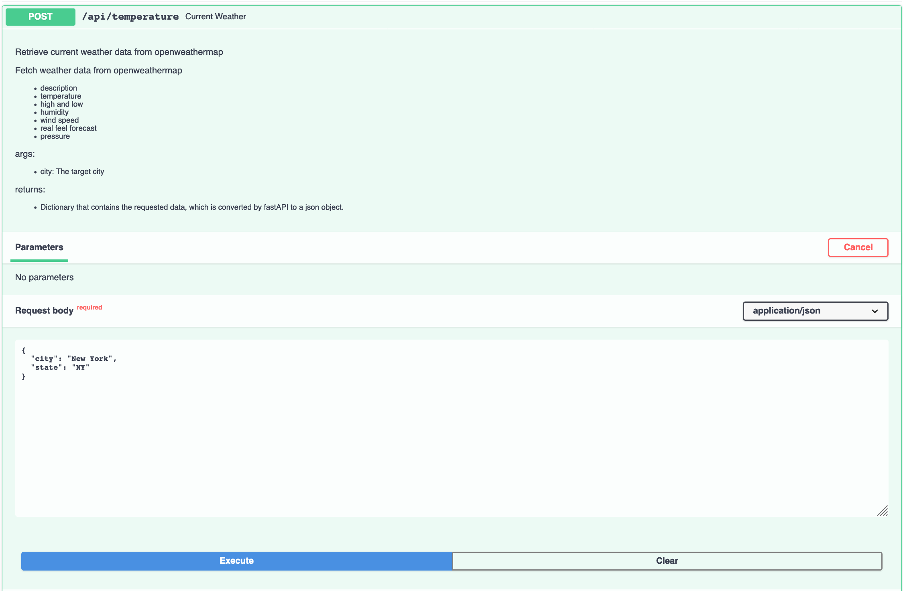
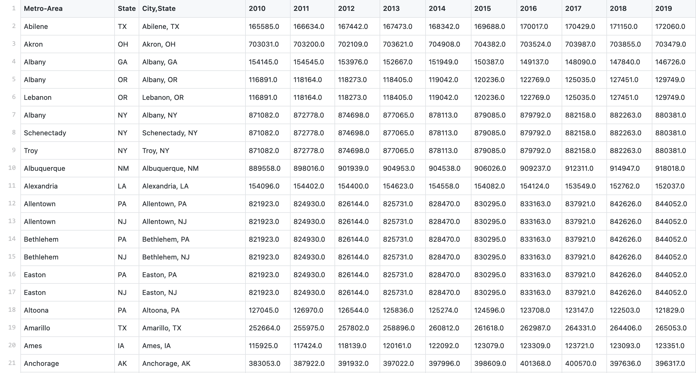
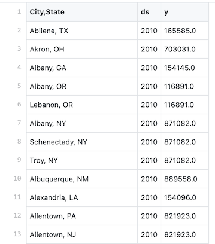
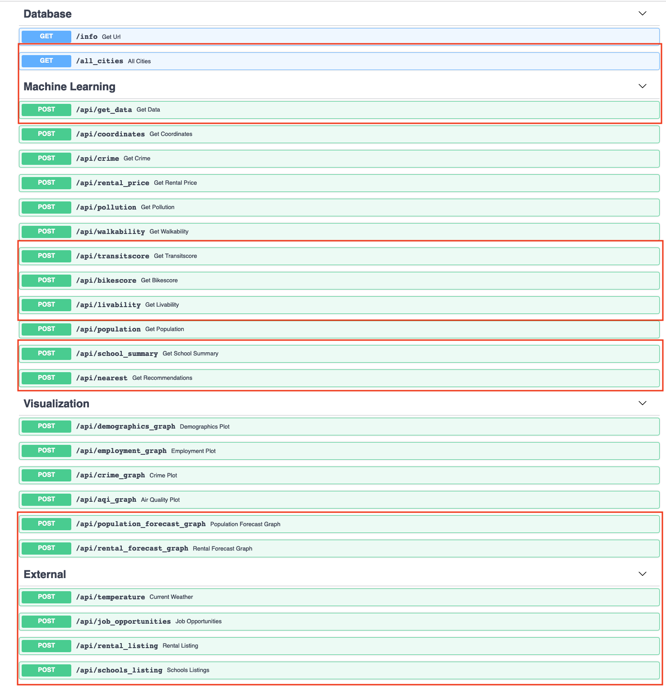
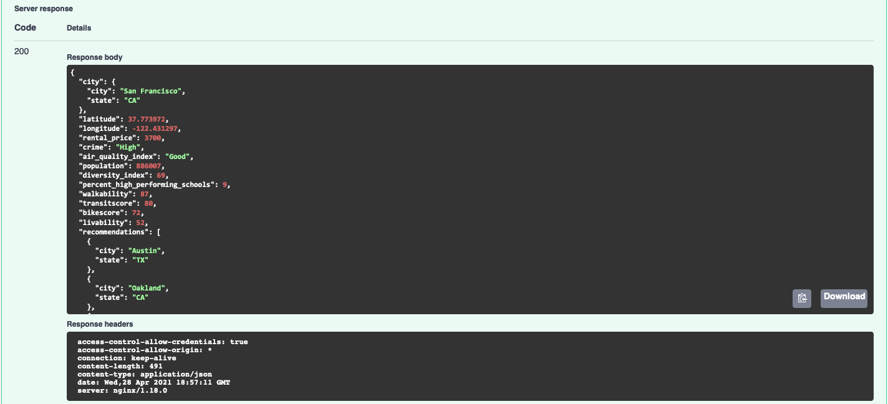
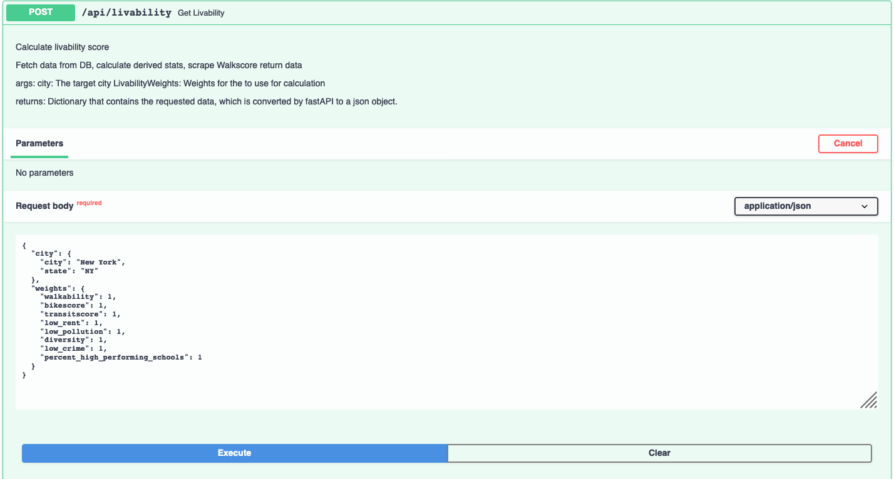
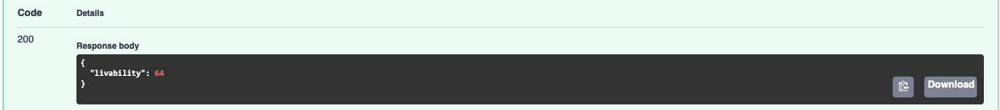

<strong>TLDR: </strong> For 8 more weeks (part time), I continued working with a (different) cross functional team on CitySpire application. The data science team collected and cleaned data, performed data analysis and feature engineering, added new features, used machine learning to create forecasting models and get recommendations. These new features were deployed using FastAPI to create the endpoints, and finally this application was deployed to a Amazon Web Services (AWS). AWS Elastic Beanstalk hosted our API and the data was stored with an  AWS Relational Database Service, specifically Postgres. While for many, they were building upon another team's inherited code base, this was actually <a href = "https://github.com/Lambda-School-Labs/labspt15-cityspire-g-ds" target="blank"> my previous team's work</a>. Unfortunately, this did not mean smooth sailing for me, there was a lot of learning, struggles, and hiccups along the way.

 

<h5 align="center"> Photo by Jonathan Roger on Unsplash </h5>

 

<h2>Introduction:</h2>

<i>-Improving upon CitySpire</i>

In my  <a href = "https://jiobu1.github.io/2021-03-04-CitySpire/" target="blank"> previous post</a>, I spoke about the building the application, CitySpire, that helps users find a new home city. CitySpire's goal is to be a one-stop resource for users to receive the most accurate city information. This app analyzes data from cities such as populations, cost of living, rental rates, crime rates, park (walk score), and many other social and economic factors that are important in deciding where someone would like to live.

<strong>Problem: </strong> While the current form of the application gives a lot of general information about a city. It gives information such as median rent, crime rate, walk score, diversity, as well as recommendations for similar cities. There was still a lot more information that a potential user would need to make such a big, life altering decision. Information, such as, schools if they are moving with children, future rental rates, population growth or decline, and two other very important factors, availability of rental properties and job opportunities.

<strong>Solution: </strong>The CitySpire 2.0 application takes the hassle out of finding the perfect city to call home by giving you a data driven recommendation in a simple format.

<strong>Constraints: </strong>My team and I were working on a tight deadline. We had to quickly get up to speed on an existing code base and integrate the <a href = "https://www.notion.so/CitySpire-9134a15c1cc3481e87f8d121f7ef3843" target="blank"> feature specifications</a> of the stakeholder.

The data science team had to finding data sources (web scraping, getting an API key, public records, etc.) to provide users with the necessary information. We had to update the current recommendation (machine learning model) and livability model, to include the  new data points. We were also tasked to  create rental, population, and weather predictions.  All this data had to be returned in a format usable by front end and can connect to the back end.

There was not as much cleaning and wrangling to do with the data. This time we had quite a bit of web data extraction, or data scraping to extract data from different websites. This presented another big constraint because our team did not have a lot of experience working with web scraping.

 

<h2>Planning:</h2>

<strong>System Architecture:</strong>

 

The planning for this focused on first understanding the features of the existing CitySpire application. What features were implemented from the stakeholder's specifications? What current features needed adjustments? What new features needed to be implemented?

Since, I was on the previous team, I was well acquainted with layout. After looking and testing the current specifications, we went through the product documentation to build upon the system architecture.

 

<h5 align="center"> System Architecture for CitySpire Team A </h5>

 

<strong>Implementation: </strong>

There were several new features that had to be implemented, so we rolled up our sleeves and got right to work. We used <a href = "https://trello.com/b/LpH3VjbS/labspt17-cityspire-a" target="blank"> Trello</a> to outline user stories and create cards to keep us on track, so that we could meet the deadline to <a href = "https://www.notion.so/CitySpire-9134a15c1cc3481e87f8d121f7ef3843" target="blank"> release features</a>.

 

<h2>Getting Up and Running: </h2>

Having had previous experience with the AWS tech stack and FastAPI, I was able to get the application up and running the first weekend. This allowed the back end to quickly connect to the data science API.

 

<h2>FastAPI:</h2>

FastAPI is a modern, high-performance, web framework for building APIs with Python based on standard Python type hints.

To get started, it was simple as running the following three commands:

<ol>
<li><code> pipenv install -- dev </code></li>
<li><code> pipenv shell </code></li>
<li><code> uvicorn app.main:app  --reload </code></li>
</ol>

The above steps work like this, it  installs the necessary packages for the application to run, then you enter the shell and finally, the last command deploys the FastAPI app.

 

<h2>AWS RDS Postgres: </h2>

In order to connect locally with FastAPI, we needed to set up a database that would house the previous data as well as the new data points that we needed to include in the 2.0 version of CitySpire.

What is AWS RDS? Amazon Relational Database Service is a distributed relational database service by Amazon Web Services. It is a web service running "in the cloud" designed to simplify the setup, operation, and scaling of a relational database for use in applications. (Wikipedia) We just chose the PostgresSQL flavor.

When developing locally, I used python-dotenv to load an <code>.env </code> file. (The <code> .env  </code> file is listed in <code>.gitignore </code>.) This made sure that the my username and password were protected. When deploying, we used the Elastic Beanstalk console for configuring environment variables there.

 

<h2>AWS Elastic Beanstalk:</h2>

After making sure we could deploy locally, we deployed our application using AWS Elastic Beanstalk.

AWS Elastic Beanstalk is an easy-to-use service for deploying and scaling web applications and services .You simply upload your code and Elastic Beanstalk automatically handles the deployment, from capacity provisioning, load balancing, auto-scaling to application health monitoring.

Using  <code> awsebcli </code>, we were able to run the following commands and we were in business!

<ol>
<li><code> eb init --platform docker CHOOSE-YOUR-NAME --region us-east-1 </code></li>
<li><code> eb create --region us-east-1 CHOOSE-YOUR-NAME </code></li>
<li><code> eb open </code></li>
</ol>

Then when making changes, we had to commit those  changes using git and then run <code>eb deploy </code> and <code>eb open </code> to re-deploy the application with the changes.

We configured our other environment variables, such as API keys as well as our database URL, to make sure our application would run properly.

 

<h5 align="center"> Include database name and URL, API keys, and other environment properties necessary for app. </h5>

 

Deploying our API on Elastic Beanstalk allowed the back end developers to connect to the data that would be then transferred to front end, allowing users to interact with it.

 

<h2>Success! </h2>

This is what it looked like after our successful deploy.

 

<h5 align="center"> The endpoints from CitySpire 1.0 </h5>

 

<h2>Data: </h2>

<strong>API KEY: </strong>

A few of the new features from the product specifications, did not require a lot of gathering and manipulating data. The data for two of the  new endpoints required making API calls from other websites.

Using an API key, I was able to format a rental listings and current weather endpoints.

 

<h5 align="center"> current weather endpoint - returns the current weather for the selected city </h5>

 

<h5 align="center"> rental api - user enters number of beds, baths, and how many listings they want to see </h5>

 

<strong>WEB SCRAPING: </strong>

Other features were not as easy to get. One feature that definitely stretched our ability was web scraping great schools for school data to present to our users. Unfortunately, at the time the site did not have a publicly accessible API. This was my first foray into web scraping.

To access this data I used<a href = "https://selenium-python.readthedocs.io/" target="blank"> Selenium</a> and<a href = "https://www.crummy.com/software/BeautifulSoup/bs4/doc/" target="blank"> Beautiful Soup</a> to create a schools csv. These were the packages necessary to work with these two libraries: Both libraries have decent documentation which was helpful in the process.

<ol>
<li><code> pipenv install bs4 </code></li>
<li><code> pipenv install requests </code></li>
<li><code> pipenv install selenium </code></li>
<li> Selenium needs a <a href = "https://selenium-python.readthedocs.io/installation.html" target="blank"> web driver</a> (the browser it automates). </li>
</ol>

The current CitySpire application has data for 374 cities. I created a csv formatting the cities based on great school's formatting (state/city), to extract school information.

 

<h5 align="center"> used city list spreadsheet and a state abbreviations dictionary to generate this newly formatted cities list </h5>

 

This is the code I used to get the schools information for the respective cities.

 

 

To find out more about this process you can read my article <a href = "https://jiobu1.github.io/2021-04-28-Web-Scraping/" target="blank"> here</a>.

<strong>MODEL: </strong>

Another feature in the product specification was to create a forecast for population, rental, and weather data.

I created a forecast model for population data. Utilizing 10 years of  historical population data from the Census Bureau, I created a model that predicted <a href = "https://github.com/jiobu1/labspt15-cityspire-g-ds/blob/main/notebooks/model/population2010-2019/file/metropop_2010_2019.csv" target="blank"> population growth</a> for the next 10 years. This model was created using FB Prophet. This was a new library for me, so I was excited to dig into the <a href = "https://facebook.github.io/prophet/" target="blank"> documentation</a> and get my hands dirty.

Prophet is a procedure for forecasting time series data based on an additive model. It works best with time series that have strong seasonal effects and several seasons of historical data. The input to Prophet is always a dataframe with two columns: <code>ds</code> and <code>y</code>.  The <code>ds</code>  (datestamp) column should be of a format expected by Pandas. The <code>y</code> column must be numeric, and represents the measurement we wish to forecast.

I used the following code:

 

 

to change my cleaned csv:>

 

to change my cleaned csv:

 

<h5 align="center"> population_cleaned.csv </h5>

 

to this:

 

<h5 align="center"> population_melt.csv </h5>

 

Then I grouped the csv by city name and changed the <code>ds</code> column to Pandas datetime format.

 

<h5 align="center"> code to dictionary of grouped csv as value and city name as key </h5>

 

Then I created a loop that went through each item in the dictionary and applied the Prophet model to the values to forecast for the next 10 years and created a prediction.csv.

 

<h5 align="center"> Prophet model </h5>

 

Prophet is very high powered. When I tried to create pickled model for live forecasting, the model was very large (22 GB). This is probably due to how sensitive it is to seasonality. Prophet was definitely a broad sword in this instance. Next time, I would just use a linear regression model since the data did not account for seasonal/holiday changes.

The final model is a visualization of the population forecast, where users can see the projected population growth for their desired city.

 

<iframe width="900" height="800" frameborder="0" scrolling="no" src="//plotly.com/~jiobu1/33.embed"></iframe>
<h5 align="center"> 10 Year Population Forecast for San Francisco, CA </h5>

 

<h2>API Endpoints: </h2>

We were able to implement most of the features outlined in the stakeholder's specifications.

 

<h5 align="center"> outlined in red are new and updated endpoints </h5>

 

<strong>Updated: </strong>

<code>/api/get_data</code> - this endpoint was updated to reflect new and updated data points. <code>get_data</code> now has <code>transitscore</code> and <code>bikescore</code> in addition to <code>walkability</code>. There is also a <code>percent_high_performing_schools</code>. It has an updated <code>livability score</code> and <code>recommendations</code>.

 

 

<code>/api/nearest</code> - this endpoint was also updated to reflect new numeric data points (bike and transit score, as well as school data).

 

 

<code>/api/livability</code> - update <code>livability score</code> to include <code>transitscore</code>, <code>bikescore</code>, and <code>percent_high_performing_schools</code>

 

<h5 align="center"> Updated livability score calculations - weights are adjustable by the user </h5>

 

<h5 align="center"> livability score </h5>

 

<strong>New: </strong>

<ul>
<li><code>/all_cities</code></li> - list all the cities in the database
<li><code>/api/transitscore</code></li> - gets bus score from walkscore.com
<li><code>/api/bikescore</code></li> - get bike score from walkscore.com
<li><code>/api/school_summary</code></li> - create summary of school information that was scraped from greatschools.org
<li><code>/api/population_forecast_graph</code></li> - create 10 year forecast of population using Prophet
<li><code>/api/rental_forecast_graph</code></li> - create 10 year rental forecast for studio to 3 bedroom rentals using past 5 year of HUD rental pricing data.
<li><code>/api/temperature</code></li> - gets current weather from openweather.org
<li><code>/api/job_opportunities</code></li> - users can query job positions in desired city using data from indeed.com
<li><code>/api/rental_listing</code></li> - returns rental listings from realtor.com
<li><code>/api/schools_listing</code></li> - returns listings of schools in desired city based on school category (pre-k, elementary, middle, and high school)
</ul>

<h2>Final Thoughts: </h2>

This project has been a very illuminating experience. It was exciting to learn "on the job", to explore new libraries and technologies. Working on a cross functional team, highlighted the importance of communication, both written and verbal. This opportunity stretched me as a professional, and I will value the collaboration and  constructive feedback provided.

<strong>Areas for Improvement: </strong>

The DS team worked hard to implement the above features, but there is always room for improvement.

Some possible next steps are:

<ul>
<li>Creating a natural language process recommendation system, where users can set criteria and receive results based on their query.</li>
</ul>

There is a lot of information that has been gathered but is not utilized fully, such as:

<ul>
<li>Utilize socioeconomic factors such as income and poverty levels</li>
<li>Prevailing industries and salaries tied to this</li>
</ul>

Other information that can be included but are not limited to:

<ul>
<li>What do people in this city do for recreation, whether it's museums, restaurants?</li>
<li>What the city is known for such as specific cultural or historical sites?</li>
</ul>

The possibilities for this application are boundless.

<h2>Team overview: </h2>

I worked for 8 weeks (part time) as an API engineer, data scientist, and machine learning engineer on a remote cross function team to build upon CitySpire.

 

<h5 align="center"> livability score </h5>

 

The team I started out with had five web developers, four data scientists, three iOS developers, and  our Team Project Lead. During the course of these 8 weeks, we became a team of five web developers, three data scientists (I was one), just one iOS developer, and our Team Project Lead. Fortunately, those left worked hard to achieve the stakeholder's vision.

 

<h5 align="center"> CitySpire Team A </h5>

 

<strong>Role: </strong>API Engineer, Data Scientist, Machine Learning Engineer, Data Visualization

<strong>DS Tech Stack: </strong>Python, FastAPI, AWS RDS Postgres, AWS Elastic Beanstalk, Beautiful Soup

<strong>Timeline: </strong>8 weeks (part-time)

Our end product can be found <a href = "https://github.com/Lambda-School-Labs/PT17_cityspire-a-ds" target="blank"> here</a>.

<h2>Links: <h2>

<strong>Data Sources: </strong>

<ul>
<li>Rental Listing - https://www.realtor.com/</li>
<li>Rental data - https://www.huduser.gov/</li>
<li>Weather information - https://home.openweathermap.org/</li>
<li>School Listings -  https://www.greatschools.org</li>
<li>Bus score and Bike score - https://www.walkscore.com/</li>
</ul>