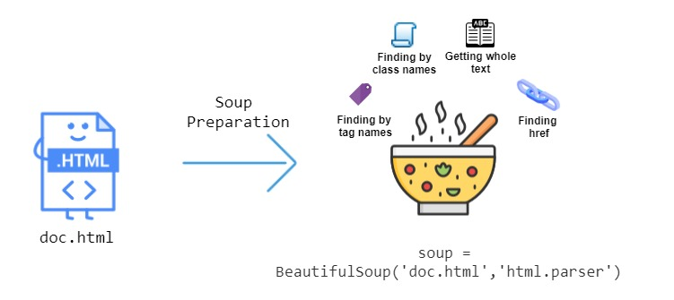

<strong>Summary</strong>This article dives into the nitty, gritty of my first experience web scraping a greatschools.org, a dynamic website. I delve into the libraries used and the packages necessary for using Selenium and Beautiful Soup. As a burgeoning, data scientist, web scraping is very much essential in data science field. I hope this article piques your curiosity.

<h5 align="center"> Photo by Jisha Obukwelu </h5>

 

<h2> Introduction: </h2>

For 8 weeks (part-time), I worked as a data scientist and machine learning engineer on a remote interdisciplinary team. We were tasked with building CitySpire 2.0, an application that is a one-stop resource for users to receive the most accurate city information.

The data science team took a completely analytical approach to finding apartments within cities. This application is prescriptive in nature, helping users to find suitable places. One feature that I worked on was integrating information about school districts and their ratings.

School information is a very big factor when people/families decide on moving to a new city. To find relevant school information, I went to <a href = "https://www.greatschools.org" target="blank"> greatschools.org</a>.

<h2> Great Schools </h2>

Great schools has a Summary Rating scale that is based on a 1–10 scale, where 10 is the highest and 1 is the lowest. Ratings of 1–4 signal that school is “below average”, 5–6, indicate “average”, and 7–10 are “above average” or “high performing”.

The Summary Rating calculation is based on four ratings, designed to show different facets of school success: the Student Progress Rating or Academic Progress Rating, College Readiness Rating, Equity Rating, and Test Score Rating. The ratings for each school vary based on data availability or relevance to a school level (for example, high schools have a College Readiness Rating, but elementary schools do not). Summary Ratings are not produced for schools if they lack sufficient data.

<h2>What is Web Scraping</h2>

Since great schools did not have an accessible API, I had to scrape the school data for the cities in our CitySpire database.

<strong>What is web scraping? Why do it?</strong>

Web scraping is the extraction of data from a website. This information is collected and then exported into a user friendly format. I created a schools listing endpoint that delivered schools information based on grade levels (prekindergarten, elementary, middle school, or high school).

<h2> Process </h2>

<h5 align="center"> greatschools.org </h5>

I do not have much experience working with web scraping, so my first attempt was with with Beautiful Soup.

<h2> Beautiful Soup </h2>

Beautiful Soup is a Python library for getting data out of HTML, XML, and other markup languages. Beautiful Soup helps you pull particular content from a webpage, remove the HTML markup, and save the information. It is a tool for web scraping that helps you clean up and parse the documents you have pulled down from the web. You can look for specific HTML tags.

When I implemented this code, it yielded an empty array.

<h2> Selenium </h2>

Upon further investigation, I saw that this was a dynamic web page with the table generated using JavaScript. After some research of other Python based web scraping packages, I came across Selenium. The <a href = "https://pypi.org/project/selenium/" target="blank"> Selenium package </a> is used to automate web browser interaction from Python. With Selenium, programming a Python script to automate a web browser is possible. Using Selenium, I was able to easily parse the JavaScript.

Selenium starts a browser session. For Selenium to work, it must access the browser driver. By default, it will look in the same directory as the Python script. Links to Chrome, Firefox, Edge, and Safari drivers are available <a href = "https://pypi.org/project/selenium/" target="blank"> here </a>. For my project I used Chrome.

<h5 align="center"> Scraping greatschools.org using selenium </h5>

This was definitely a more promising start. I was able to return the following table. Below are the results from this code.

<h5 align="center"> Results from using Selenium to scrape greatschools.org </h5>

<h2> Some Things Just Go Better Together </h2>

The table above showed that I was on the right track. Just looking further at the `School` column, there were several pieces of information that were all together and not easy to split using regex (believe me, I tried).

<h5 align="center"> School column had several things included in one column </h5>

<h5 align="center"> row school contains - school score and rating, name, and address </h5>

After several trial and errors, I was able to create loop that used Selenium to access the web page and Beautiful Soup to parse the information in the `School` column.

<h2> Data Extraction and Cleaning </h2>

<strong> Prerequisites: </strong>

To run both Selenium and Beautiful Soup several packages need to be installed.

<strong> Selenium: </strong>

<ol>
<li>1. `pipenv install selenium`</li>
<li>2. Selenium needs a web driver (the brower is automates). I chose Chrome.</li>
</ol>

To read more, you can go to <a href = "https://selenium-python.readthedocs.io/installation.html" target="blank"> Selenium’s documentation</a>.

<strong> Beautiful Soup for extracting data: </strong>

<ol>
<li>1. `pipenv install bs4`</li>
<li>2. `pipenv install requests`</li>
</ol>

<h5 align="center"> https://stackabuse.com/guide-to-parsing-html-with-beautifulsoup-in-python/ </h5>

Using Beautiful Soup allowed me to parse the `School` column, to extract the different elements inside the school row on greatschools.org.

<strong> HTML Description: </strong>

These are the common HTML elements that I looked for with Beautiful Soup.

<ol>
<li> 1. The `<table>` tag is used to render data in the form of a table. `<td>` for columns, and `<tr>` is for rows.</li>
<li> 2. `
` is used as a container to represent an area on the screen.</li>
<li> 3. `<a>` defines a hyperlink.</li>
<li> 4. To get the specific row, column, container, etc. you will then specify the `class`, to parse out the data you are trying to retrieve.</li>
</ol>

<strong>Example:</strong>`soup.find('div', {'class': 'circle-rating - small'})`

<h5 align="center"> https://stackabuse.com/guide-to-parsing-html-with-beautifulsoup-in-python/ </h5>

<h5 align="center"> https://stackabuse.com/guide-to-parsing-html-with-beautifulsoup-in-python/ </h5>

<h2> So, Where's the Code? </h2>

If you are like me, you are probably be thinking "This is all well and good, but where is the code?" So not to disappoint, this is the code that I used to scrape greatschools.org (They have recently created a <a href="https://www.greatschools.org/api/signup/" target="blank"> free public API </a> to interact with their site and to retrieve data to use for your own personal projects. ).

1. The current CitySpire application has data for 374 cities. I created a csv formatting the cities that I needed to extract school information.

<h5 align="center"> used city list spreadsheet and a state abbreviations dictionary to generate this newly formatted cities list </h5>

 2. Below is the code that I used to get the schools information for the respective cities.

I will break this large chunk of code down.

- `driver = webdriver.Chrome()` This opened up the Chrome browser that what used to parse greatschool's dynamic site.

- Since, each city has a different number of schools, I could not set a specific page number so I utilized the `pagination-summary`.

<h5 align="center"> while loop that continues to incrementally scrape greatschools </h5>

This while loop continues to increase the page number if the total number of schools has not been reached.

This what the pagination summary looks like:

<h5 align="center"> pagination summary text </h5>

<h5 align="center"> pagination summary HTML </h5>

Using regex, I separated the pagination summary as a list, and then retrieved the third item (ending number) and the fifth item (total number) of the list, and compared the two numbers. If the ending number is equal to or greater than the total number, this will break the loop.

- The last part of the code, utilizes Beautiful Soup to parse the elements of the table.

<h5 align="center"> this code parses the table and then appends the info to it’s own record. </h5>

<h2> Conclusion </h2>

I hope you enjoyed this article! This was actually a deep dive for me into something that I have not had experience with. Selenium is often necessary to extract data from websites using lots of JavaScript and with Beautiful Soup, you can easily parse information using the HTML tags. I had a lot of fun working with Selenium and Beautiful Soup and diving into the documentation.

<h5 align="center"> Resulting dataframe from web scraping </h5>

There is still so much for me to learn. I know that my above code is not perfect, I am sure that my while loop could be better. I also learned that I could have done this with just Selenium or just Beautiful Soup but this duet made navigating the page easier for my first time.

<h2>Going Further</h2>

There was more cleaning and feature engineering that I had to do to create the finalized schools.csv and two endpoints that serve schools related data.

<strong><a href= "https://github.com/jiobu1/labspt15-cityspire-g-ds/blob/main/notebooks/datasets/data/schools/csv/final_school.csv"> Schools.csv </a></strong>

<h5 align="center"> finalized school.csv -> cleaned address column, categorized schools from pre-k to high school </h5>

<strong><a href= "https://github.com/jiobu1/labspt15-cityspire-g-ds/blob/main/app/external.py"> Schools.csv </a></strong>

<h5 align="center"> schools endpoint returns a list of schools based on users desired city and school category </h5>

<strong><a href= "https://github.com/jiobu1/labspt15-cityspire-g-ds/blob/main/app/ml.py"> Schools.csv </a></strong>

<h5 align="center"> returns total schools, number of private, public, charter, and percentage of highly performing schools </h5>

<h2></h2>

To learn more, you can follow the below links:

— To learn more about web scraping, you can go <a href= "https://github.com/jiobu1/labspt15-cityspire-g-ds/blob/main/notebooks/datasets/data/schools/schools.ipynb">here</a>.

— To see how I cleaned the table, you can go <a href= "https://github.com/jiobu1/labspt15-cityspire-g-ds/blob/main/notebooks/datasets/data/schools/school_cleaned.ipynb">here</a>. 

— To see the schools.csv, you find it <a href= "https://github.com/jiobu1/labspt15-cityspire-g-ds/blob/main/notebooks/datasets/data/schools/csv/final_school.csv">here</a>.

— To see how I created categorized pickled dictionaries, you can go<a href= "https://github.com/jiobu1/labspt15-cityspire-g-ds/blob/main/notebooks/model/schools/pickle_schools.ipynb">here</a>. (This was for faster look up. The csv has >65K rows.)

— To see how I summarized the school info, you can go <a href= "https://github.com/jiobu1/labspt15-cityspire-g-ds/blob/main/notebooks/datasets/datasets_to_merge/labs2/add_school.ipynb">here</a>.

— You can find the schools_listing endpoint <a href= "https://github.com/jiobu1/labspt15-cityspire-g-ds/blob/main/app/external.py">here</a> and the school summary, endpoint <a href= "https://github.com/jiobu1/labspt15-cityspire-g-ds/blob/main/app/ml.py">here</a>.

